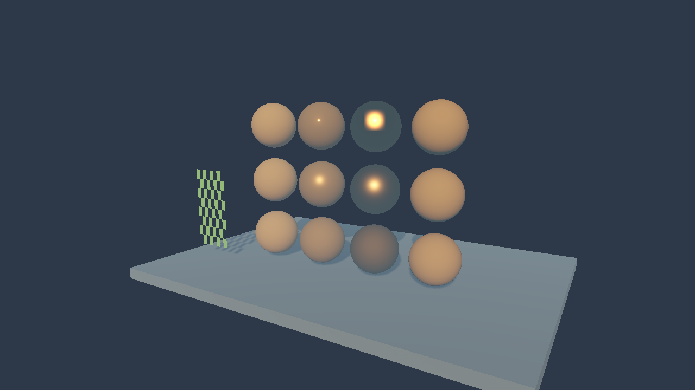
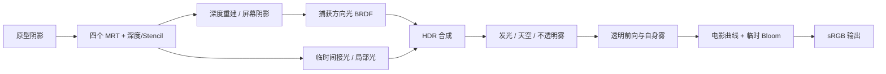

# Relink 独立 SRP：首轮复刻

> 本文保留首轮实现时的状态与公式推导。当前城镇、完整场景模块及最新验收见 [城镇实现记录](Relink-Town-Implementation.md)；本文中的“尚未实现”和“下一批”只描述首轮快照。

更新：2026-10-07。Unity 6000.3.10f1 / D3D11。本轮开始实施 [后续计划](Relink-Roadmap.md) 的数据契约和方向光部分，以正常捕获 `standard_d3d11_frame10803.rdc` 为依据。

已交付四个 GBuffer、可采样的 D32S8 深度/Stencil、分类方向光、捕获中的 BRDF 和电影曲线，以及场景和数值验证。速度目前覆盖相机运动。原型中的阴影、间接光、天空、雾、透明和 Bloom 仍作为临时模块；这不是整个游戏渲染的完成版本，也没有通过与游戏相同素材的逐像素或视觉等价验收。

## 运行

1. 打开 `Assets/RelinkStyle/Generated/RelinkScenePipeline.asset`。`Rendering Path` 已设为 `EvidenceDeferred`，三个 Shader 已序列化引用。
2. Unity 菜单 `Tools > Relink SRP > 3 - Open Environment Demo` 打开场景演示，或 `5 - Open Material Reference Scene` 打开材质参考场景。两张场景现在也支持从 Project 窗口直接双击：Editor 自动配置 Graphics 和当前 Quality 的独立 SRP、最终画面模式，并显示 Game 视图。旧管线保存在 `ProjectSettings/RelinkPipelineBackup.json`，可用 `Restore Previous Pipeline` 恢复。
3. 项目使用 Linear 颜色空间。管线资产的 `Debug View` 切换下表中的中间目标。`PrototypeForward` 可切回此前原型。

参考场景包含三行粗糙度（从下到上 0.9 / 0.4 / 0.08）、四列金属度/分类、双面 Alpha 裁剪和阴影接收面。前三列金属度为 0 / 0.5 / 1；第四列金属度输入为 1，但 flags=64 强制方向光按非金属计算。Stencil 四列为 1 / 2 / 5 / 129，对应类别 1 / 2 / 5 / 10。演示曝光 +2 是自建场景的预览参数，尚未拟合原游戏自动曝光。

`RelinkEnvironment.unity` 是庭院/树木环境演示；下图的球阵列来自 `RelinkMaterialReference.unity`。截图使用场景 Main Camera，查看时应使用 **Game** 视图；Scene 视图有独立镜头。已有演示场景可用 `Tools > Relink SRP > Show Current Demo Camera` 重新配置并显示相机。Editor 首次成功渲染后，会在 `Temp/RelinkDemoPreview` 留下当前主项目的预览和实际管线/API 状态，方便区分隔离验证与主项目运行。

本轮修复了直接打开演示 `.unity` 后仍运行 URP 的入口问题。主项目已现场确认材质球出现，实际渲染记录为 `RelinkRenderPipeline / EvidenceDeferred / Direct3D11 / debug=0`，Graphics 与当前 Quality 引用一致，Shader 错误列表为空。保存了 [主项目运行状态](Evidence/srp-deferred/MainProject-status.json)、[主项目材质预览](Evidence/srp-deferred/MainProject-MaterialReference.png) 和 [主项目环境预览](Evidence/srp-deferred/MainProject-Environment.png)。



## 数据契约

| 资源 | Unity 格式 | 数据和约定 |
| --- | --- | --- |
| GBuffer0 | R8G8B8A8_SRGB | RGB：线性底色写入后由 RTV 编码，读取时自动解码；A：flags / 255，不做 sRGB 转换 |
| GBuffer1 | R8G8B8A8_UNorm | R 金属度；G 粗糙度；B 间接光衰减；A 保留，未赋予原游戏含义 |
| GBuffer2 | A2B10G10R10_UNormPack32 | RGB：归一化视空间法线 ×0.5+0.5；A 保留为 0；D3D11 对应 R10G10B10A2 |
| GBuffer3 | R16G16_SFloat | UV 速度：当前位置减前帧位置；D3D11 UV 向下为正；不含 jitter |
| 深度/Stencil | D32_SFloat_S8_UInt | Unity 反向 Z；Stencil Ref 来自材质；以 Depth/Stencil SubElement 分别绑定读视图 |
| 屏幕阴影 | R16_SFloat | 接收阴影系数，目前来自旧二级联 PCF 适配器 |
| HDR / 直接光 / 间接光 | B10G11R11_UFloatPack32 | D3D11 对应 R11G11B10_FLOAT；没有 Alpha 通道 |

材质启用 `Use Deferred Mask Map` 后，Mask 的 RGBA 直接写入 GBuffer1。未启用时，取 `_Metallic`、`1-_Smoothness`、Occlusion.G 与强度、保留值 0。Mask 输入应为线性纹理；底色为 sRGB 输入。顶点风动和 Alpha Clip 共用原函数，GBuffer、发光和 ShadowCaster 使用相同裁剪。

Stencil 类别严格按 `(stencil & 15) + ((stencil & 128) != 0 ? 9 : 0)` 解码；方向光由 16 位类别掩码筛选，超出范围的类别不受此光照。flags 的 bit 64 强制非金属；bit 32 的输出 Alpha 分支也保留，但当前 RGB HDR 目标不保存 Alpha。Stencil 读取兼容其 R/G 通道布局；已实测 D3D11 的原生 Stencil SRV，未增加第五个类别 MRT。

相机矩阵显式使用 GPU 的 RT 投影，与材质写深度、全屏重建和天空保持一致。原游戏正向深度转换被 Unity 的反向 Z 及逆矩阵重建替代，材质格式保留。首次渲染、尺寸变化、游戏帧间断、较大位移/转向会清空相机速度历史；切镜也可调用 `RelinkRenderPipeline.ResetCameraHistory(camera)`。刚体、蒙皮和风动的前帧顶点尚未接入，因此 GBuffer3 不是完整运动矢量实现。

## 已还原的公式

方向光对应 [正常帧 20304 的像素 Shader](Evidence/standard-d3d11/Shaders/event_20304_ShaderStage.Pixel.asm)。设 `m` 为金属度、`r=clamp(roughness,0.04,1)`，`H=normalize(V+L)`：

```text
radiance = max(lightColor - subtractLightTexture, 0)
diffuse  = albedo * radiance * (1-m) * saturate(N·L) / π
d        = (N·H)² * (r⁴-1) + 1
specular = albedo * radiance * m * saturate(N·L) * r⁴
           / [4π * (r+0.5) * ((L·H)*d)²]
direct   = (diffuse + specular) * screenShadow
```

该变体没有通用 GGX 的介电 F0 / Schlick Fresnel。材质 flags、Stencil 掩码、减光输入和类别 5 的可选阴影旁路在独立 Pass 中实现；减光贴图缺省为黑，旁路缺省关闭，与捕获开关为 0 一致。仅在奇异分母/半角退化处加小量保护，这是工程差异。颜色和光源单位由 Unity 输入，尚未把游戏常量（例如捕获的方向光 RGB=62.5/53.546707/34.313725）与全部曝光/IBL 参数联合拟合。

上式的 `N·L`、`N·H`、`L·H` 均取 saturate 后的值；Mask 中的粗糙度先钳制。减光输入采样后的 RGB 参与线性辐射量减法。

电影曲线对应 [正常帧 31660](Evidence/standard-d3d11/Shaders/event_31660_ShaderStage.Pixel.asm)：

```text
x = HDR * 2^exposure
film = ((x*(0.15*x+0.05)+0.004)/(x*(0.15*x+0.5)+0.06) - 1/15) * 1.379064
result = saturate(film + bloom)
```

Shader 输出线性结果，由 Unity 的 sRGB 目标编码一次。原型的 ACES 拟合、饱和度、对比度和屏幕描边不会进入延迟路径的最终曲线；它们仍用于原型模式。Bloom 输入暂用四分之一分辨率阈值/高斯实现，其位置改为曲线之后相加，原游戏多尺度 Bloom 尚未复刻。

## 帧调度和调试



| Debug View | 内容 |
| --- | --- |
| 0 / 1 | 最终结果 / HDR |
| 2 / 3 / 4 | 编码视空间法线 / 线性深度÷100 / 原型边缘诊断 |
| 5 / 6 | 线性底色 / Mask 的 RGB |
| 7 | UV 速度 ×20+0.5；静止为灰色 |
| 8 | Stencil 类别÷24；类别 10 为 10/24 |
| 9 / 10 / 11 | 方向光 / 屏幕阴影 / 半球间接光候选值 |
| 12 | flags÷255 |

PNG 调试图经过目标 sRGB 编码，仅用于观察。数值检查从线性 RGBAFloat RT 读取，不能用 PNG 颜色反推 Mask、法线或光照值。View 11 保留间接光候选目标，关闭 `Indirect Lighting` 只影响最终 HDR 的加入。

## 验证与证据

运行 `Tools/Rendering/validate_relink_srp.ps1`。它在 `Temp/RelinkDeferredValidation` 内准备无包依赖的隔离项目，以 D3D11 和真实 GPU 运行，不替换主项目当前场景。通过后保存证据，并同步已生成的材质参考场景及其素材；Unity 路径可用 `-UnityEditorPath` 指定。

- [17 项 GPU 数值检查](Evidence/srp-deferred/contract.txt)：底色、线性 Mask、视空间法线、深度、原生 Stencil 分类、方向光公式、类别排除、flags、减光钳制、电影曲线、相机速度符号、尺寸/显式切镜重置、Alpha 裁剪。
- [集成验证](Evidence/srp-deferred/result.txt)：Shader 无编译错误，场景非空，阴影、太阳和雾关闭都有可测差异；保留的前向原型也通过运行回归。
- [验证清单](Evidence/srp-deferred/manifest.json)：时间、Unity 版本、图形 API、GPU、模块差异统计及源文件 SHA-256。
- [场景输出](Evidence/srp-deferred/Environment.png) 和上述材质参考图：已人工检查方向、遮挡、材质行列和裁剪图案。

BRDF 数值容差考虑 GBuffer 量化及 R11/G11/B10 的有效位数，尤其 B10 的 5 位尾数。电影曲线在浮点输出中的最大通道误差约 8.4e-9；相机平移速度诊断误差约 2.44e-4。CPU 公式核对验证的是实现和数据流，尚未完成游戏同一像素的 RenderDoc Shader Debug 数值对照。没有完成性能预算、其他图形 API 或 Player 构建验收。

## 下一批工作

1. 三层 2048² 方向光阴影数组、全屏 blocker search / PCSS、级联混合，替换二级联 PCF。逐层读取正常捕获，确认搜索半径和线性深度换算。
2. 全局/局部漫反射和镜面 IBL、BRDF 表、区域混合与箱体修正；替换半球光。纯金属目前没有正确的镜面环境光。
3. tile 点光列表和局部阴影数组；当前只有最多 8 个未投影的局部光，衰减是 Unity 适配公式。
4. 刚体/蒙皮/风动速度和连续帧捕获，再做两段时域历史；之后实施自动曝光、双 LUT、多尺度 Bloom、真实天空/雾和深度线条。

代码入口：`Runtime/RelinkDeferredRenderer.cs` 调度，`Shaders/RelinkDeferred.shader` 延迟照明，`RelinkSourceLighting.cginc` 源公式，`RelinkEnvironment.shader/.cginc` 材质契约，`Editor/RelinkDeferredValidation.cs` 浮点 GPU 验证。所有文件位于 `Assets/RelinkStyle`，不依赖 URP 的程序集、Pass 或 Shader include。
