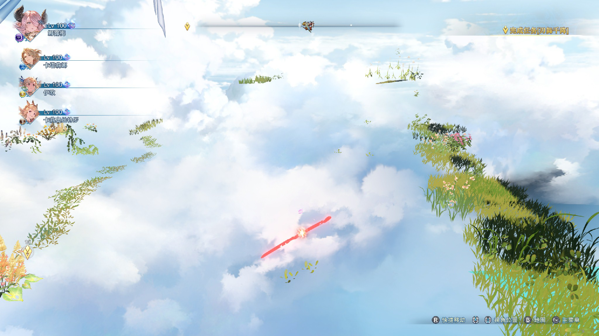
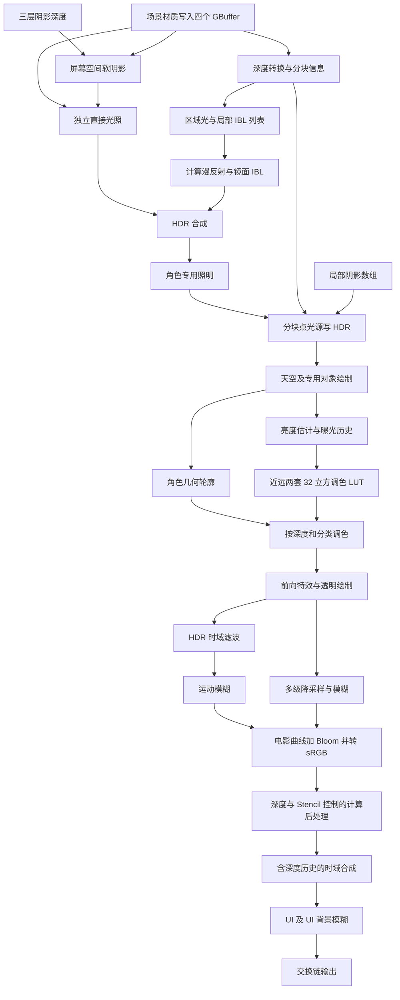
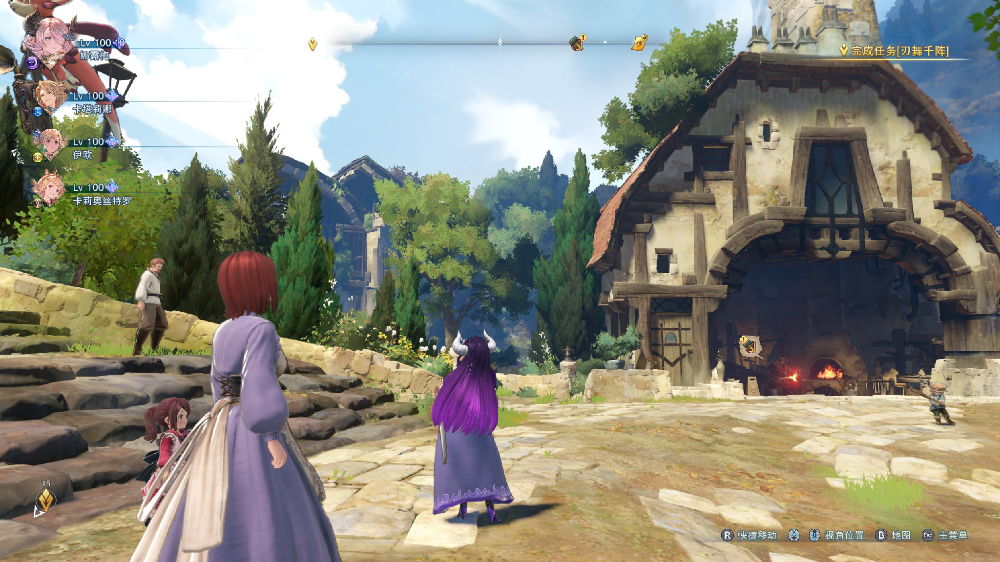

# Relink 场景渲染逆向记录

更新：2026-10-07。目标工程：Unity 6000.3.10f1，独立 SRP，场景优先。

**旧 RDC 的主体几何缺失；已取得完整场景的新捕获并成功离线回放。** `NV.BlockNVAPI` 与记录全部 command lists 的组合恢复了地面、建筑和人物。第 10 节保留首次分析，第 11 节补充当前发现。独立 SRP 与八方旅人城镇已交付，工程状态和原作差异见 [城镇实现记录](Relink-Town-Implementation.md)。

## 1. 样本及可信度

| 项目 | 记录 |
| --- | --- |
| 游戏 | 本机 Steam 安装，标题显示 Endless Ragnarok；上一轮标题菜单显示 ver 2.0.6 |
| 原始异常捕获 | `Captures/Relink/relink_frame18802.rdc`，615,711,594 字节 |
| SHA-256 | `5563D52096F128D8DBA0607A3A7CD66E4C3224359C43534B834089C2C8D96592` |
| 工具 / GPU | RenderDoc 1.46；NVIDIA GeForce RTX 5080，驱动 32.0.16.1088 |
| 图形 API / 输出 | D3D11；2560 × 1440 |
| 捕获内统计 | 1,203 个 action，1,140 个 draw action，13 个 dispatch action |
| 旧帧分析覆盖 | 56 个代表事件的绑定、反射、常量和 DXBC 反汇编；正常帧另核对 34 个事件 |
| 资源分组 | 51 个连续颜色/深度目标分组；**不等于 51 个逻辑 Pass** |

这些数量只描述异常捕获，不能推广到正常帧。未测有效 GPU 时间，不能据此做性能预算。

证据分为三类：

- **直接观察**：资源格式、绑定槽位、纹理尺寸、已绑定 Shader、指令和常量。
- **算法解释**：根据读写关系及指令推导的用途；需用正常捕获及像素调试再核对。
- **待验证**：未捕获或因画面异常不能判断的内容；不使用“没有某功能”代替“未见证据”。

## 2. 捕获异常：先解决这个问题



地面、建筑和角色主体缺失，草、花、天空、部分特效与 UI 仍显示。RDC 内置缩略图、离线回放和注入中的游戏现场画面均出现此问题。因此，这不是仅在 `SaveTexture` 导出或离线回放中发生的显示错误。

捕获进程的 [诊断日志摘录](Evidence/frame18802/capture-diagnostic-excerpt.log) 显示，进入场景后反复查询 `NvAPI_D3D11_MultiDrawIndexedInstancedIndirect`，RenderDoc 返回 NULL；日志还提示 DX11.2 tiled resources 不受支持。`GetDebugMessages()` 返回空列表并不能证明捕获正确：关键警告在注入进程日志中。

无注入启动后，同一城镇的地面、建筑和人物正常。随后启用 `NV.BlockNVAPI=true` 和 CaptureAllCmdLists，注入现场、内置缩略图、离线回放及 GBuffer 都恢复完整；不再出现原来的 MultiDraw 查询拒绝日志。DX11.2 tiled resources 警告仍存在，因此它在此次测试中没有阻止主体几何出现。

**已确认这组配置解决当前捕获的几何缺失。** 因为两个设置同时变化，尚不能把全部影响唯一归因于 NVAPI；原来的接口拒绝与其消失仍使 MultiDraw 路径成为最有力的解释。不能将旧图空缺误判为材质缺失、场景没有不透明物体或游戏只绘制植被。

RenderDoc 1.46 的 [NvAPI Hook 源码](https://github.com/baldurk/renderdoc/blob/v1.46/renderdoc/driver/ihv/nv/nvapi_hooks.cpp) 未为该 MultiDraw 接口提供专用记录封装；默认路径会拒绝未支持的查询。该源码同时提供 `NV.BlockNVAPI`，可使初始化报告无 NVIDIA 设备，用于测试应用是否转入标准路径。实际是否回退仍由游戏决定。

直接打开 unsupported vendor extensions 只是放行接口，不能证明绘制已序列化；[RenderDoc API 定义](https://github.com/baldurk/renderdoc/blob/v1.46/renderdoc/api/app/renderdoc_app.h) 明确说明这一选项可能导致错误回放。**恢复现场画面与恢复正确 RDC 是两个独立验收项。**

排查顺序及结果记录在 [后续实施计划](Relink-Roadmap.md)。[本轮完整注入日志](Evidence/standard-d3d11/launch-diagnostic.log) 记录捕获进程读取 `NV.BlockNVAPI=true`。实验启动脚本是 `Tools/Rendering/launch_relink_capture.ps1`；它拒绝关闭现有游戏，启动后恢复临时 RenderDoc 配置。恢复配置不会改变已经运行的捕获进程所读取的值。

## 3. 捕获中可见的管线结构

下图概括正常帧核对后的主要依赖，仍省略具体材质变体及部分专用绘制。**下方旧事件表以及第 4–7 节使用旧帧编号**，便于追溯首次分析；对应正常帧的 Shader 哈希和新编号见第 10 节。不能把连续目标分组当成完整的逻辑 Pass 列表。



| 事件 | 直接观察 | 解释与限制 |
| --- | --- | --- |
| 2808–3479、4491–7520 | 写三层 R16 深度资源；抽样深度比较为 Greater | 阴影绘制；资源相同不代表层相同 |
| 3832–3942 | 仅主深度/Stencil 目标，8 个 draw | 捕获可见的深度先行绘制；不代表完整预通道 |
| 7551–8127 | 四个 MRT、主深度/Stencil，37 个 draw | GBuffer 材质写入，当前主要可见植被 |
| 11134、11145 | 深度转换，32×30 线程组的 tile 信息构建 | 后续光照/IBL 以深度范围分块 |
| 11170 | 读取阴影数组与深度，写 R16 全屏纹理 | 屏幕空间阴影遮蔽计算 |
| 11229–11444 | 修改材质和阴影目标的体积绘制 | 区域作用流程，具体类别还需逐 draw 核对 |
| 11492–11606 | 计算粒子相关结构缓冲读写 | 粒子模拟；不能把所有 CS 都归入光照 |
| 11636–11805 | 区域/IBL 列表及漫反射、镜面结果 | 混合全屏绘制与计算光照 |
| 13288、13339 | 深度驱动颜色处理、天空立方体及速度写入 | 专用处理与天空，详见 Shader 证据 |
| 13359–13426 | 256×144 颜色缩小、亮度估计、1×1 历史更新 | 自适应曝光相关流程 |
| 14647、14654、14678 | 两次 LUT 生成及深度分区调色 | 调色发生在随后的一组特效绘制前 |
| 14768–17162 | 多组 HDR 前向绘制，部分带 A8 附加输出 | 特效/透明/专用对象；不统一视为纯透明 |
| 17213–17518 | 1280×720 到 80×45 金字塔，九次采样的模糊 Shader | 多尺度后处理；不能仅凭尺寸判每层都是 Bloom |
| 17543–17628 | 速度降采样、tile 速度和深度速度纹理 | 运动模糊辅助信息 |
| 17650 | Current、History、GeometryBuffer03 | HDR 时域滤波，实际可见重投影及历史钳制 |
| 17699、17748 | Color、DenoisedColor、TiledVelocity、DepthVelocity | 两次运动模糊 Shader 绘制 |
| 17794 | HDR、曝光、Bloom | 电影曲线及 sRGB 输出 |
| 17816、17839 | 深度范围处理，CS 读取颜色/深度/Stencil | 含深度线条参数的屏幕处理；需核对完整视觉作用 |
| 17899 | 当前/历史颜色、当前/历史深度、速度，两输出 | 第二个时域合成阶段 |
| 17946–20162 | UI 目标及 1920×1080 模糊目标，cbUICamera/cbUIGauss | 这些模糊属于 UI，不能算成场景景深 |
| 20189、20192 | 交换链写入及 Present | 最终输出 |

## 4. GBuffer 与场景材质

事件 7551 的实际 **view format** 如下。资源本身多为 TYPELESS，应以 RTV/SRV 格式解释颜色空间。

| MRT / 资源 ID | RTV 格式 | 已解码内容 |
| --- | --- | --- |
| 0 / 4378 | R8G8B8A8_SRGB | RGB 底色；A 被后续读取为 8 位标志 |
| 1 / 4556 | R8G8B8A8_UNORM | R 金属度、G 粗糙度；B 对间接漫反射与镜面光照作乘法衰减；A 未完整解码 |
| 2 / 4388 | R10G10B10A2_UNORM | RGB 为编码法线；A 未完整解码 |
| 3 / 4392 | R16G16_FLOAT | 屏幕 UV 运动向量：当前位置减前帧位置，含投影偏移处理 |
| 深度 / 289613 | D32S8 | 几何深度和 Stencil 分类；场景样本使用 LessEqual |

全部为 2560×1440、单样本。法线写入 `N * 0.5 + 0.5`，光照阶段解码并归一化；IBL Shader 进一步用逆视图矩阵变换，支持这里存储**视空间法线**的解释。MRT1.B 具有材质遮蔽的作用，但贴图制作语义及所有变体仍需确认。

事件 7551 的 Shader 明确读取：

- `g_AlbedoCacheTexture`：BC7_SRGB 纹理数组。
- `g_NormalCacheTexture`：BC5_UNORM 纹理数组，重建法线 Z 后用切线基变换。
- `g_MaskCacheTexture`：BC7_UNORM 纹理数组，将 mask 的 RGB 写入 MRT1。
- `g_PageTableTexture`、`g_TileSetParamBlock`、`g_StreamTextureParamBlock`：页表及采样参数。
- `g_ResolveParam0/1/2`：像素阶段 UAV 声明；完整反馈协议未解码。

这是材质缓存/页表体系的直接证据，支持流式或虚拟纹理式采样的解释；**尚未证明采用 D3D tiled resources 的哪一种具体实现**。不能直接将缓存数组作为普通 `_MainTex` 导出后声称已复原材质。

还保留了 `g_UseNoise`、`g_NoiseColor`、`g_NoiseScale`、`g_UseWaveColor`、背面法线及多个运动参数。噪声在此 Shader 内影响底色；这不等于全屏统一的手绘噪声，也不证明场景使用当前 SRP 的程序化排线。

## 5. 光照和软阴影

**延迟照明已得到直接绑定证据。** 事件 11674 在场景几何写入后读取 GBuffer00/01/02、深度、Stencil 和全屏阴影。存在连续的 `N·L`、金属度/粗糙度运算及非线性镜面项；这个 Shader 没有当前原型那种统一 diffuse 分段量化。不能把整个场景概括为三段 Toon Ramp。

阴影资源 4603 是 **2048×2048×3 的 Texture2DArray**，深度视图为 D16、读取为 R16_UNORM。11170 的 `ShadowView_Buffer` 中：

| 参数 | 本帧值 | 范围 |
| --- | --- | --- |
| `g_ShadowSpritLength` | 25、115、300、300 | 游戏空间单位；不是所有地图固定设置 |
| `g_ShadowPenumbraScale` | 0.05 | 当前场景参数 |

该 Shader 按世界空间距离选层，并在层边界进行过渡；先进行遮挡深度搜索，利用搜索结果调整半影范围，再进入 6×4 次比较采样的过滤分支。采样旋转受帧计数影响。可将其理解为**带遮挡搜索的软阴影/PCSS 类方法**，但还没有用有效几何验证所有分支及精确半影公式。它明显比原型的固定 3×3 PCF 更复杂。

局部 IBL 的证据来自 11145、11636、11727、11770、11805：

- tile 深度范围/占用位图、区域/立方体索引表通过 CS 构建。
- 漫反射辐照度和预滤波镜面立方体数组分开读取，并有 BRDF 二维表。
- 按区域矩阵、边界和混合权重采样；可见位置修正/盒投影式计算。
- 漫反射与镜面分别写中间结果，再由全屏 Shader 合成；还存在 `g_DiffuseAmbientAreaLight`。

因此 SH 加半球色只够充当后备环境光，不能替代这一体系。暂未得到完整实时 GI、SSR 或独立 SSAO 算法的证据，不能宣称有或没有这些功能。

## 6. 天空、曝光、调色与最终曲线

13339 读取天空立方体，应用强度、旋转与颜色矩阵，同时输出速度。当前程序天空只是原型选择，不是对原游戏天空算法的复现。

13379 从缩小的 HDR 纹理抽取 11 个亮度样本，做逆亮度估计并限制范围。13426 读取当前估计与前帧曝光：

```text
adapt = clamp(previous + (estimate - previous) * rate, minimum, maximum)
本帧 minimum = 1，maximum ≈ 1.414214，rate ≈ 0.015000
```

这只是本帧参数，尤其不能用异常天空占据画面的亮度结果校准正常曝光。

14647 / 14654 以 `[2,2,32]` 调度、`[16,16,1]` 线程组，分别生成资源 333 / 340：**32×32×32、RGBA16F 的近/远 3D LUT**。14678 读取这两个 LUT、深度、曝光和 Stencil，包含场景及角色的独立范围/参数。可见深度驱动的空间调色；不要把 LUT 中的 PQ 风格编码常数直接解释为最终 HDR 显示输出，本帧交换链仍为 RGBA8 UNORM。

17794 的电影色调映射可直接从指令还原。令 `x = sceneHDR * adaptedExposure`，`b` 为该事件采样的 Bloom 值：

```hlsl
float3 film = (x * (0.15 * x + 0.05) + 0.004)
            / (x * (0.15 * x + 0.50) + 0.060) - 0.066667;
float3 linearOutput = saturate(film * 1.379064 + b);
// 随后显式执行线性颜色到 sRGB 的分段转换。
```

这和当前 Composite 中的 `(2.51*x+0.03)/(2.43*x+0.59+...)` 拟合曲线不同；Bloom 在这个事件中加在曲线之后。复现时必须检查 RenderTexture 的 sRGB 标记，避免重复编码。

## 7. 时域、运动模糊与线条

**运动向量和历史缓冲已确认存在。** 17650 以 `uv - velocity` 访问历史颜色；对压缩颜色空间进行 YCoCg 变换，并用五样本均值/方差限制历史范围，混合分支中出现 0.98。17899 使用另一套历史颜色和深度、邻域/深度判定及速度控制的历史权重，常数 0.925。它们是两个不同事件，不能合并成“只做一次 TAA”，也不能仅从这一帧验证实际稳定性。

17543–17628 生成多尺度速度与深度速度辅助目标；17699、17748 的 Shader 使用 tile 速度、深度和沿运动方向的采样，支持运动模糊的解释。

17839 是 `[160,90,1]` 调度、`[16,16,1]` 线程组的全屏 CS，读取场景颜色、深度和 Stencil，写 RGBA8 UAV。参数包含 `depthLineThreshold*`、`width_`、近远阈值、颜色及中心/边缘系数。本帧 `width_≈4.6`，`widthClose_=0`。这是深度线条相关后处理的证据，但完整作用仍需有效几何、禁用对照和像素调试；不能等同当前统一的深度/法线边缘乘色。

角色 Shader 还出现 `g_OutLineColor`；角色自身轮廓与场景屏幕处理需要分开逆向。屏幕排线、线条、美术底色、材质噪声也应分别查证。

## 8. 现有 Unity SRP 与实测差距

| 模块 | 当前实现 | 证据导向的调整 |
| --- | --- | --- |
| 主渲染 | 法线/深度预通道 + 前向 HDR | 增加四目标 GBuffer、Stencil 分类与独立照明 |
| 阴影 | 两级 atlas，固定 3×3 PCF | 三层数组、全屏阴影、搜索半影及边界混合 |
| 间接光 | SH/半球色 | 漫反射/镜面 IBL、BRDF 表、局部区域混合 |
| 材质 | 普通纹理、可调风格化参数 | 先实现可审查的 mask 契约；缓存页表作为后期专项 |
| 调色 | 曝光、饱和度、对比度及拟合曲线 | 自适应曝光、近远 LUT、按分类处理、实测电影曲线 |
| 时间处理 | 无历史和速度目标 | 静态/刚体/蒙皮/风动速度，TAA、历史失效处理 |
| 描线 | 通用深度/法线边缘 | 根据深度和类别验证独立线条流程 |
| 特效 | 普通透明前向 | 专用效果材质、粒子及天空/雾的正确合成时序 |

独立 SRP 保留为工程底座与快速 A/B 模式，当前 demo 及 `SRP-Validation.txt` 只证明其可以编译渲染、阴影/主光/雾开关有作用，**不证明 Relink 外观一致**。本轮未修改这些 Shader 来追赶异常画面。

## 9. 可复现分析与证据文件

运行示例（在工程根目录的 PowerShell 中）：

```powershell
$env:RELINK_RDC = (Resolve-Path 'Captures/Relink/standard_d3d11_frame10803.rdc').Path
$env:RELINK_ANALYSIS_OUTPUT = Join-Path (Get-Location) 'Temp/RelinkAnalysisExample'
$env:RELINK_INSPECT_EVENTS = '12890,19735,20304,20400,23009,24874,24905,31516,31660,31705,31765'
$env:RELINK_SNAPSHOT = '0'
& 'Temp/RelinkTools/RenderDoc/RenderDoc_1.46_64/qrenderdoc.exe' --python (Join-Path (Get-Location) 'Tools/Rendering/inspect_relink_capture.py')
```

分析脚本以实际 action flags 选择 VS/PS 或 CS，避免把尚未解绑、却未在当前事件执行的 Shader 当作当前 Pass。`RELINK_SNAPSHOT=1` 可导出中间目标，`RELINK_SNAPSHOT_EVENTS` 可限制导出的事件。深度 PNG 默认只导出 slice 0、未经科学范围重映射；多层阴影应在 Texture Viewer 逐层核对。PNG 会截断 HDR 范围，不用于数值拟合。事件采样尚未覆盖 HS/DS/GS，不能用本工具的未输出证明这些阶段不存在。检查 `analysis_status.json` 的完成状态，不只依赖 GUI 启动程序的退出码。

- 旧异常帧：[资源和 action 清单](Evidence/frame18802/inventory.json)、[56 事件摘要](Evidence/frame18802/events_summary.json)、[原始常量](Evidence/frame18802/selected_constants.json)。
- 正常帧：[资源和 action 清单](Evidence/standard-d3d11/inventory.json)、[34 事件摘要](Evidence/standard-d3d11/events_summary.json)、[原始常量](Evidence/standard-d3d11/selected_constants.json)。
- 各证据目录下的 `Shaders/`：活跃阶段 Shader 的反汇编，与事件编号对应。
- 原始 RDC 已移出 Unity `Temp`，由 `.gitignore` 排除；没有把游戏原始素材加入 Unity Assets。

完整场景捕获和核心中间目标已取得；下一步是像素级解释、分类位解码及跨帧验证。单帧还不能确定历史资源初始化、跨帧反馈、不同地图参数和所有材质变体。

## 10. 正常帧复核与新增发现



| 项目 | 正常场景样本 |
| --- | --- |
| RDC | `Captures/Relink/standard_d3d11_frame10803.rdc` |
| 大小 / SHA-256 | 1,080,501,545 字节；`5546F3AA190A7815CD61A21E32BE48F3D65E7B5523B94F8C1F5DF63734FC4EF1` |
| API / 输出 | D3D11，2560×1440；RenderDoc 1.46，RTX 5080 |
| action / draw / dispatch | 4,030 / 3,958 / 17 |
| 目标分组 | 56 个连续颜色/深度目标组；不等于逻辑 Pass 数 |
| GBuffer | 12890–19647，共 979 次 draw；底色、法线、mask、速度和深度目标均可离线导出 |
| 细查 | 34 个代表事件；25 个 PS/CS 事件与旧帧抽样 Shader 哈希相同 |

[离线最终输出](Evidence/standard-d3d11/final.png) 与内置缩略图包含相同的地面、建筑、人物和 UI。已检查 [GBuffer 底色](Evidence/standard-d3d11/gbuffer-albedo.png)、[法线](Evidence/standard-d3d11/gbuffer-normal.png)、[阴影深度 slice 0](Evidence/standard-d3d11/shadow-depth-slice0.png)；它们都有实际主体几何。法线图是编码值的 PNG 预览，不用于数值拟合；阴影图不是三层全部内容。

另两次捕获 `standard_d3d11_frame18024.rdc` 和 `standard_d3d11_frame36437.rdc` 用于重复验收，结果记录在 [样本清单](Evidence/standard-d3d11/manifest.json)。它们不是连续帧，不能作为 TAA 跨帧分析。无注入基线与新捕获使用同一城镇，但镜头位置和时间不同；统计差值不能直接量化旧帧丢失百分比。

### 10.1 正常帧对应事件

| 功能 | 旧异常帧 | 正常帧 | 复核 |
| --- | --- | --- | --- |
| GBuffer 采样材质 | 7551 | 12890 | PS 哈希相同；四个 RTV 格式、D32S8 与 LessEqual 一致 |
| 深度转换 / tile 信息 | 11134 / 11145 | 19699 / 19710 | PS / CS 哈希相同 |
| 屏幕软阴影 | 11170 | 19735 | PS 哈希相同，输出视图为 R16_FLOAT |
| 主直接光 | 11674 | 20304 | PS 哈希相同，读取 GBuffer 与阴影 |
| 区域 / IBL 列表和照明 | 11636 / 11694 / 11727 / 11770 / 11805 | 20266 / 20324 / 20357 / 20400 / 20435 | 五个 PS/CS 哈希相同 |
| 天空 | 13339 | 23091 | PS 哈希相同 |
| 亮度估计 / 历史曝光 | 13379 / 13426 | 23131 / 23178 | PS 哈希相同，参数仍以新帧值为准 |
| 近远 LUT / 调色 | 14647 / 14654 / 14678 | 24874 / 24881 / 24905 | 两个 CS 和一个 PS 哈希相同 |
| HDR 时域滤波 | 17650 | 31516 | PS 哈希相同；Current、History、速度绑定一致 |
| 运动模糊 | 17699 / 17748 | 31565 / 31614 | PS 哈希相同 |
| 电影曲线 | 17794 | 31660 | PS 哈希相同；之前还原的曲线仍适用 |
| 深度/Stencil 屏幕处理 | 17839 | 31705 | CS 哈希相同；完整几何的前后差异尚待逐像素细查 |
| 后段时域合成 | 17899 | 31765 | PS 哈希相同；颜色/深度历史和速度仍存在 |
| 最终交换链写入 | 20189 | 34199 | 由 action 清单及最终输出核对 |

哈希对应保存在 [Shader 对照表](Evidence/standard-d3d11/shader-comparison.json)。相同 Shader 证明算法字节码相同，不意味着不同时间的常量、资源内容或每个分支都相同。

### 10.2 补齐的局部光与角色流程

**分块点光源及局部阴影已获得直接证据。** 22976 读取 `g_PointLightCullingArray` 与深度 tile 信息，生成索引缓冲；23009 读取 `g_PerTileLightIndex`、点光数据、GBuffer、Stencil、阴影/遮罩资源，再以 UAV 写入主 HDR 资源 4372，视图为 R11G11B10_FLOAT。该 CS 为 `[8,8,1]` 线程组、`[320,180,1]` 调度，并声明 Typed UAV Load Additional Formats。

其中 `g_PointLightShadowMaps` 绑定资源 343：2048×2048×16 的数组，SRV 为 R16_FLOAT；5825–6100 的 111 次绘制写这个数组，并用单层深度目标测试。它与三层方向光深度数组资源 4366 是不同资源。点光投影方式、数组层分配、遮罩含义及精确过滤还需追踪，不能直接当作 16 个立方体阴影。

**场景是混合照明路径。** 20491–22968 在延迟照明/IBL 合成后执行 160 次带 `CharacterShaderParam`、方向光/点光及 CutCharacter 参数的 HDR 绘制。角色也能出现在 GBuffer 中，因此不能简单划分成“场景延迟、角色完全前向”；需要解释这些额外照明分支。

23243–24868 的 90 次绘制读取角色/材质参数，在 VS 出现 `g_OutLineThickness`、`g_EnableCamvecOffset`，PS 出现 `g_OutLineColor`、`g_OutLineColorBlend`，并使用 SrcAlpha/InvSrcAlpha 混合，输出 HDR 颜色和速度。这支持独立角色几何轮廓 Pass 的解释；其展开方向、背面剔除及遮挡规则仍需核对。它发生在天空/曝光之后、LUT 调色之前，与 31705 的屏幕深度处理不同。

正常帧证据保存于 `Evidence/standard-d3d11/`：资源清单、合并的 34 事件摘要、选取常量、活跃阶段 Shader 反汇编及中间图。原始 RDC 继续留在 `Captures/Relink/` 并排除 Git。阶段 0 的捕获修复与重复回放已通过；完整像素级等价和性能尚未验收。

### 10.3 首轮工程复刻

已依据正常帧 12890、20304、31660 实施 GBuffer、分类方向光和电影曲线，公式与初次验收见 [首轮记录](Relink-Implementation.md)。该段保留首次工程快照，后续三层阴影、IBL 和场景其余阶段已接入 [城镇实现](Relink-Town-Implementation.md)。自建场景的 GPU 契约检查不是原游戏逐像素等价证明。

## 11. 城镇复刻阶段的追加发现

以下均来自正常帧的活跃 Shader 与常量，不使用异常帧空缺推断功能。

| 事件/证据 | 新结论 | 实现影响与限制 |
| --- | --- | --- |
| [12890 PS](Evidence/standard-d3d11/Shaders/event_12890_ShaderStage.Pixel.asm)，末段输出 | o0.w、o1.w、o2.w 为 0 | 本变体的 flags/保留通道为零；不能推广到全部材质 |
| [19735 PS](Evidence/standard-d3d11/Shaders/event_19735_ShaderStage.Pixel.asm)、选取常量 | 三层尺度 1/.08/.025、32 blocker 与24比较；相对深度平方×128，Param1.x=.03125 | Unity 使用同类搜索与过滤，Gather、投影和偏移做工程适配 |
| [5825 VS](Evidence/standard-d3d11/Shaders/event_5825_ShaderStage.Vertex.asm)、[PS](Evidence/standard-d3d11/Shaders/event_5825_ShaderStage.Pixel.asm) | 先变换到局部视图，方向归一化；xy 除以 z+1，z 为径向 near/far 映射，PS 写径向深度 | 确认局部阴影含抛物面投影，不能把16层当作16个cubemap |
| [23009 CS](Evidence/standard-d3d11/Shaders/event_23009_ShaderStage.Compute.asm) | 半球选择与径向深度比较、多种局部光类型、阴影/遮罩和 BRDF 查询 | 已实现两个R16F半球和16次径向比较；保留六面对照，完整面积光分支未闭合 |
| [20324 CS](Evidence/standard-d3d11/Shaders/event_20324_ShaderStage.Compute.asm)、[20400 CS](Evidence/standard-d3d11/Shaders/event_20400_ShaderStage.Compute.asm) | 材质漫反射为 albedo*(1-metal)*mask.B/π；镜面结构为 (albedo*metal*BRDF.R + BRDF.G*(1-r⁴))*mask.B/π，BRDF UV 为 (NdotV,1-rough) | 自烘焙 cubemap/积分 LUT 保留材质结构，但采用自己的 rough 轴和归一化；原 SH、数据布局未复制 |
| [23131 PS](Evidence/standard-d3d11/Shaders/event_23131_ShaderStage.Pixel.asm)、[23178 PS](Evidence/standard-d3d11/Shaders/event_23178_ShaderStage.Pixel.asm) | 11个固定采样位置，亮度(.298912,.586611,.114478)，倒数均值与钳制历史插值 | 已实现；曝光 key 和时间适配为可调工程值 |
| [31516 PS](Evidence/standard-d3d11/Shaders/event_31516_ShaderStage.Pixel.asm) | 当前/历史先做 c/(c+1)，YCoCg 钳制，低亮度旁路，.98历史权重 | 已实现核心步骤，并增加3×3方差/深度拒绝；非指令级等价 |
| [31705 CS](Evidence/standard-d3d11/Shaders/event_31705_ShaderStage.Compute.asm) | 颜色梯度平方、深度/中心位置系数，Stencil排除9–13，细微有色压暗 | 独立于几何轮廓接口，不称作法线边缘黑描边 |

曝光位置为 (.5,.5)、(.2,.5)、(.8,.5)、(.5,.2)、(.5,.8)、(.35,.35)、(.65,.35)、(.35,.65)、(.65,.65)、(.1,.5)、(.9,.5)。线条捕获常量包括 ThresholdOffset=.6、Scale=5、Smin=.765、Smax=.755、DepthRangeScale=3、Offset=-3、线性颜色(.943119,.908003,.895963)、中心系数2/近6/外围3及 FarZ=30000；Smin/Smax 的反向关系保留，深度单位和美术强度单列为适配。

5825 的 `tmp_ShadowViewParams=(1,1,8.5699997,.002)` 已补入 [选取常量](Evidence/standard-d3d11/selected_constants.json)；PS以 direction.z + .002 裁剪，最后一项是半球重叠。Unity 城镇使用可调 .05 来覆盖粗网格的接缝，分辨率/偏移/过滤核也是适配；不声称这些参数与源游戏相同。Native Player event3144 的颜色视图确认为 R16_FLOAT，深度测试 D16，见 [实际GPU状态](Evidence/srp-town/native-shadow-event.json)。

追加工程证据在 `Evidence/srp-town`：18项真实GPU检查、7项连续帧检查、3固定视图、中间目标、源代码哈希及3种分辨率分段计时。双抛物面前/后半球及接缝、受控单骨骼变形、风动、遮挡解除和动态曝光已通过；原作全像素/全部变体、复杂动画和正式实时预算仍未通过；[后续计划](Relink-Roadmap.md) 将它们与已实现模块分开。

### 11.1 原作方向光的逐像素数值闭合

使用 RenderDoc 1.46 的 DebugPixel / ContinueDebug 在可信帧事件 20304 调试 8 个像素，保存 [原始寄存器轨迹](Evidence/standard-d3d11/directional-pixel-trace.json)。只从轨迹提取底色、视空间法线/位置、材质、阴影、减光纹理和 LightCommonBuffer；`Tools/Rendering/check_relink_directional.py` 独立重算 NdotL / NdotH / LdotH 和还原公式，不用最终 BRDF 中间寄存器充当答案。

结果见 [像素数值报告](Evidence/standard-d3d11/directional-pixel-oracle.json)：8/8 通过，阈值 1e-5，最大绝对 RGB 误差 **4.6233777473e-8**。样本包含 metal=0、约 .003922、metal=1、受光及阴影为零的像素。对照对象是源 Shader 混合前 `o0.rgb`；它不包括 HDR 量化/混合、后处理或整帧图像，也没有验证该游戏其他方向光变体。

复查命令（不启动游戏）：

```powershell
python Tools/Rendering/check_relink_directional.py Documentation/Rendering/Evidence/standard-d3d11/directional-pixel-trace.json Documentation/Rendering/Evidence/standard-d3d11/directional-pixel-oracle.json
```
