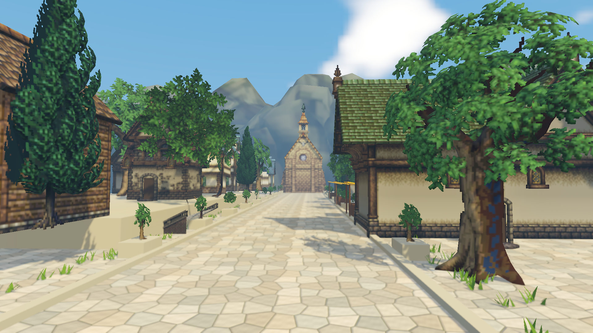
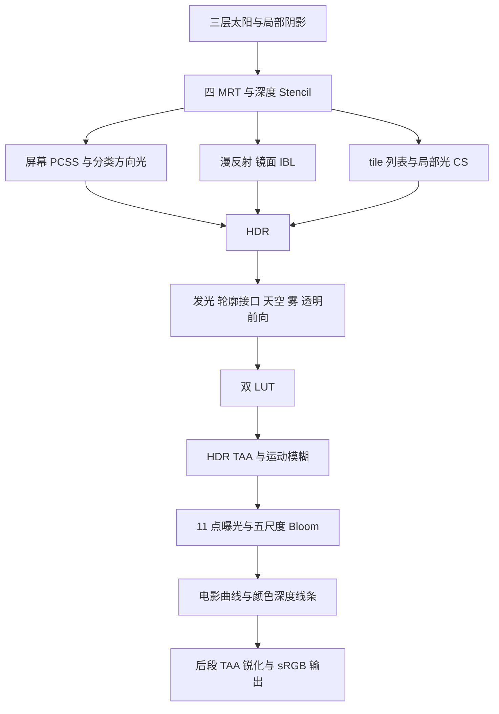

# Relink 独立 SRP 与八方旅人城镇

更新：2026-10-07。Unity 6000.3.10f1 / D3D11 / NVIDIA GeForce RTX 5080。依据完整且可重复回放的 `standard_d3d11_frame10803.rdc`；异常帧只作捕获诊断。

已交付八方旅人城镇，以及四 MRT、分类直接光、tile 局部光、三层 PCSS、双抛物面点光/聚光阴影、全局/局部漫反射和镜面 IBL、天空、区域雾、曝光、双 LUT、多尺度 Bloom、两段时域合成、运动模糊、颜色深度线条与独立几何轮廓接口。42 项 GPU 检查通过，Windows Player 可渲染并被 RenderDoc 捕获；另有 8 个原作方向光像素通过公式数值对照。**这是基于证据并做 Unity 适配的场景实现，尚不等于原游戏全部 Shader 或逐像素等价复刻。** 未闭合任务见末节。



## 打开与浏览

1. Unity 编译完成后，选择 `Tools > Relink SRP > 7 - Open Octopath Town`，或双击 `Assets/RelinkStyle/Generated/RelinkTown.unity`。
2. 查看 **Game** 视图。入口自动把 Graphics 和当前 Quality 设置为 `RelinkTownPipeline.asset`；Scene 视图有独立镜头。
3. Play 后点击主街/露台/广场按钮，或按 1/2/3。WASD/方向键移动，Q/E 升降，Shift 加速，右键拖动转向。这是自由浏览相机。
4. 管线 Inspector 的 Debug View 切换中间目标，0 为最终图。菜单 5/3 仍可打开材质球参考与旧庭院。

菜单 6 重新生成城镇，菜单 8 烘焙城镇镜面与漫反射探针。重建会替换本任务生成的场景；手动布景后应另存场景。旧管线备份在 `ProjectSettings/RelinkPipelineBackup.json`，通过 `Restore Previous Pipeline` 恢复。主项目现场预览和实际管线状态写入 `Temp/RelinkDemoPreview`，与隔离验证证据分开。

## 资产与构图

24 栋建筑、教堂远景、东西街区、露台台阶、市场摊位、50 组树木/花盆植被与远景岩石，加上3个合并的路边草网格，共 158 个 Renderer。三个固定相机书签用于对照。生成器引用原 FBX 网格和底色，创建 SRP 新材质；法线复制到生成目录，以线性 Normal Map 导入，不更改原资产。

| 来源，均位于 `Assets/Resources/Art/Test` | 用途 |
| --- | --- |
| `八方旅人1/建筑1/MbdMD_Co_T_Plain_L_A_Build_02` | 按子网格从多建筑 FBX 中拆出西侧民居 |
| `八方旅人1/建筑1/MbdMD_Co_T_River_L_A_WeaponShop`、`ObjMD_Church_A` | 铁匠铺与教堂 |
| `八方旅人2/建筑/EnvBdgMD_City_C_Outdoor_4W4D_A`、`EnvBdgMD_City_D_Outdoor_4W5D_2F` | 酒馆、旅馆、商人街区、门窗 |
| `八方旅人2/建筑组件/EnvObjMD_Stairs_A_Large` | 台阶与高差 |
| `八方旅人2/植物_八方旅人2/树灌木/EnvFldMD_Tree_E_MA_LOD0`、`EnvFldMD_Tree_I_L` | 阔叶树、针叶树及花盆植被 |
| `八方旅人2/山石_八方旅人2/EnvFldMD_FoliageStone_A_MA` | 远景岩壁 |

地基、路缘、花盆、摊位和补充木门为生成几何。铺地为确定性周期 Voronoi 石板、磨损色差/苔色接缝及倒角法线；210簇路边草合并成3个网格，顶点红色固定根部并参与风动。这些是场景美术适配，不属于原游戏算法的证据。没有把 Relink 网格复制进工程。八方旅人资产的像素纹理、贴图中烘入的明暗和建筑轮廓仍不同于 Relink；渲染管线不能补出不存在的模型细节。

## 数据契约

| 资源 | 格式和内容 |
| --- | --- |
| GBuffer0 | RGBA8 sRGB；底色 RGB、线性 flags/255 |
| GBuffer1 | RGBA8 UNorm；金属度/粗糙度/间接遮蔽/保留 A |
| GBuffer2 | R10G10B10A2；视空间法线 ×.5+.5，A=0 |
| GBuffer3 | RG16F；current UV − previous UV，最终路径包含管线 jitter 差值 |
| 深度/Stencil | D32S8，Unity 反向 Z，分别绑定 Depth/Stencil SRV |
| 太阳阴影 | 2048²×3，D16，各层独立视投影 |
| 局部阴影 | 512²×16，R16F 点光径向深度、D16 栅格测试/聚光深度；点光两个半球，保留六面切换 |
| 屏幕阴影 | R16F |
| HDR/直接光/间接光 | R11G11B10F；tile 阶段使用 typed UAV |
| 历史 | 每相机 HDR/后段 RGBA16F、深度 R32F、1×1 曝光 R32F |

底色读取只解码一次，最终由 sRGB 目标编码一次。Mask 使用线性输入。所有 GBuffer、发光、阴影 Pass 共用材质采样、风动和 Alpha Clip。Stencil 解码为 `(s & 15) + ((s & 128) ? 9 : 0)`，方向光按 16 位类别掩码筛选。flags bit64 强制非金属，bit32 的 Alpha 分支保留，但 RGB HDR 不存 Alpha。正常帧 12890 的 MRT1.A/MRT2.A 为零，仅适用于该变体。

## 捕获算法与适配

方向光来自正常帧 20304，完整推导与数值容差见 [首次实现记录](Relink-Implementation.md)。保留减光钳制、非金属漫反射、金属度相关镜面和类别规则；没有加入该变体不存在的通用介电 F0/Schlick 项。现已用原作 Shader Debug 的底色、法线、位置、金属度、粗糙度、阴影和常量重新计算 8 个像素（包含 metal=0 与 metal=1），与混合前 RGB 的最大绝对误差为 4.63×10⁻⁸；见 [像素对照](Evidence/standard-d3d11/directional-pixel-oracle.json)。这只验证采样的方向光变体。太阳按捕获的 62.5:53.546707:34.313725 相对颜色设置；绝对强度、曝光 key 和美术色调为当前资产的适配值。

太阳阴影使用 25/115/300 米划分、32 次 spiral blocker 搜索、24 次比较过滤及一米边界混合。保留 19735 的层尺度 1/.08/.025、相对深度平方×128 的 blocker 能量及 Param1.x=.03125。原作 blocker 阶段使用 Gather，当前显式 Load；Unity 的投影和深度偏移也有差异。

点光沿世界 ±Z 分成两个半球：顶点把光源相对方向 xy 除以 z+1，以 `(radius-near)/(far-near)` 写 R16F；片元裁剪半球，消费端做16次径向比较。结构来自源5825/23009，Unity纹理Y、D16栅格测试、512²分辨率、深度偏移及过滤位置做适配。原 `tmp_ShadowViewParams=(1,1,8.57,.002)` 中最后一项用于半球重叠；粗网格城镇采用可调 `.05`，接缝前后遮挡均为0。设置 `dualParaboloidPointShadows=false` 可回到六面点光，聚光继续用透视D16。原面积光/遮罩分支仍独立未闭合。

全局 HDR 天空做 GGX 多 mip 预滤波与余弦漫反射积分。两个本地探针从城镇实际六面 HDR 渲染烘焙，再卷积镜面与漫反射 cubemap；烘焙时禁用局部探针参与，避免自反馈。镜面做箱体投影，每个 cubemap 按自己的 mip 数采样；覆盖按剩余权重累加，余量回退全局环境。保留源 IBL 材质结构 `albedo*metal*BRDF.R + BRDF.G*(1-r⁴)`；原区域 SH、LUT 字节与单位未复制，当前资源按自烘焙积分归一化。

曝光保留 23131 的 11 个固定采样点、亮度权重 (.298912,.586611,.114478)、倒数均值及 23178 的历史钳制插值。速度改为帧时间指数适配，并提供 key。近远两套 32³ LUT 在 HDR log 坐标采样并按距离混合；颜色为城镇预设。Bloom 使用五级降采样和可分离模糊。

31660 电影曲线保持原公式，曲线之后加 Bloom：

```text
film(x)=((x*(.15*x+.05)+.004)/(x*(.15*x+.5)+.06)-1/15)*1.379064
```

HDR TAA 保留 31516 的 `c/(c+1)` 压缩、YCoCg、速度重投影、低亮度旁路和 .98 历史权重。工程上加入 3×3 方差裁剪、深度拒绝及速度减权；后段 TAA 使用 .925。运动模糊为 8 tap 深度拒绝实现。切镜、大位移/转向、投影/尺寸变化与帧间断会使历史失效；也可调用 `ResetCameraHistory(camera)`。正交 jitter 用投影平移项，透视 jitter 用投影中心项。

刚体使用每相机前帧物体矩阵，风动使用前帧时间，蒙皮接入 Unity skinned motion vectors 顶点流。刚体、相机与历史生命周期已测试，动态蒙皮/风动的逐帧验收尚未完成。

31705 线条使用颜色梯度平方和深度/Stencil 条件，排除 9–13；它不是全场景法线黑描边。捕获参数与工程预设分开，深度单位做米到游戏尺度适配。`RelinkOutline` 提供独立几何轮廓 Pass，默认关闭；材质需设置非零 `Geometry Outline Width`，并非完整角色复刻。

## 调度与入口



曝光和部分空间效果的时序为工程整合，未声称完全复制原作调度。太阳和局部 shadow culling 分别 Submit，防止后续 culling 覆盖尚未提交的太阳绘制；这也是后续优化成本之一。

| `Assets/RelinkStyle` 中的入口 | 作用 |
| --- | --- |
| `Runtime/RelinkDeferredRenderer.cs` | MRT、分类光照、透明路径与临时资源 |
| `Runtime/RelinkAdvancedRenderer.cs` | 阴影、tile、探针与雾绑定 |
| `Runtime/RelinkTemporalRenderer.cs` | 历史、jitter、曝光和后处理 |
| `Runtime/RelinkSceneVolume.cs`、`RelinkMotionHistory.cs` | 区域组件和物体历史 |
| `Shaders/RelinkSceneLighting.cginc`、`RelinkTileLighting.compute` | PCSS、IBL、雾和局部光 |
| `Shaders/RelinkTemporal.shader` | LUT、两段 TAA、模糊、曝光、Bloom、曲线、线条 |
| `Editor/RelinkTownSceneTools.cs`、`RelinkLightingBaker.cs` | 布景、材质适配、探针和 LUT |
| `Runtime/RelinkTownNavigator.cs` | 视角和自由浏览 |

不使用 URP 程序集、Renderer Feature 或 Shader include。Debug View：0 最终、1 HDR、2 法线、3 深度、4 原型边缘；5 底色、6 Mask、7 速度×20+.5、8 类别/24、9 太阳、10 阴影、11 IBL、12 flags、13 太阳层0、14 太阳投影、15/16 局部阴影数值诊断。PNG 有 sRGB 编码，数值验收用线性 RGBAFloat 读回。

## 验收与复现

```powershell
& 'Tools/Rendering/validate_relink_srp.ps1'
& 'Tools/Rendering/validate_relink_town.ps1' -Method MyMission.Rendering.Editor.RelinkTownSceneTools.ValidateTown
& 'Tools/Rendering/validate_relink_town.ps1' -Method MyMission.Rendering.Editor.RelinkTownSceneTools.BuildBenchmarkPlayer
& 'Tools/Rendering/validate_relink_dynamic.ps1'
```

验证运行于两个 Temp 无包项目，不关闭主编辑器。城镇工具只在新鲜结果、编译和全部检查通过后同步生成资产及 `.meta`，保留脚本/Shader GUID。

- [17 项基础 GPU 契约](Evidence/srp-deferred/contract.txt)：GBuffer、Stencil、BRDF、flags、减光、电影曲线、相机速度、裁剪。
- [18 项新增验收](Evidence/srp-town/advanced-contract.txt)：tile/raster 误差 0；六面点光与双抛物面前/后半球遮挡、接缝；粗糙度 IBL；刚体速度 .04995117 对照 .05；重置/尺寸/切镜；两段时域亮度；双 LUT；局部漫反射、区域边界和区域雾。
- [7 项连续帧验收](Evidence/srp-town/dynamic-contract.json)：Player 实际推进 Unity 帧，风动 12 帧最大 UV 误差 2.22×10⁻⁵；单骨骼变形速度 .04995117 对照 .05；风动/蒙皮重置；遮挡解除误差 0、随后 16 帧最大变化 6.11×10⁻⁵；曝光在 512 帧内从 .837402 单调降至 .277588。曝光适配使用实际 unscaledDeltaTime，帧数不代表固定墙钟时长；受控单骨骼测试不代表所有角色动画均已验证。
- [城镇运行结果](Evidence/srp-town/town-result.txt)、[代码哈希](Evidence/srp-town/manifest.json)、[露台](Evidence/srp-town/Town-Terrace.png)、[广场](Evidence/srp-town/Town-Plaza.png) 与中间目标。
- [性能与捕获报告](Relink-Town-Performance.md)：三种分辨率的 Player 图、RDC 哈希、GPU 分段时间与测量局限。

## 尚未闭合的原作等价任务

1. 双抛物面 R16F 结构已实现并验收；原全部点光层映射、偏移/过滤和面积光/遮罩分支仍未逐像素闭合。局部 BRDF/衰减采用方向光公式和 Unity 适配。
2. 原区域 IBL 的 224 字节数据、150 条 tile 列表、完整 SH/原 LUT，以及缓存页表/材质流送调度未按原布局重建。当前限制：32 局部光、16 阴影面、2 探针、4 雾区域，世界轴对齐区域，仅验收 D3D11。
3. 方向光 8 个原作像素已闭合；其余 Shader/变体和原作连续帧仍需补做。Unity 的受控蒙皮、风动和遮挡解除验收已通过，真实复杂角色动画和跨地图序列未验证。角色专用照明、面部、头发和战斗特效是原计划场景之后的专项，本城镇没有角色复刻验收。
4. 素材密度与模型比例不同。暖阳、冷色阴影和蓝色远景朝参考调整，但没有同素材/同镜头的相似度指标；实时帧率、多画质和低端硬件预算也不能由高端 GPU 回放推断。

下一步先对照原点光阴影/IBL 数据，再取得原作连续帧和复杂动画闭合动态对照，最后优化绘制/阴影批次并制定画质预算。无证据前，不新增 SSAO、SSR、实时 GI 或景深的原作功能结论。
