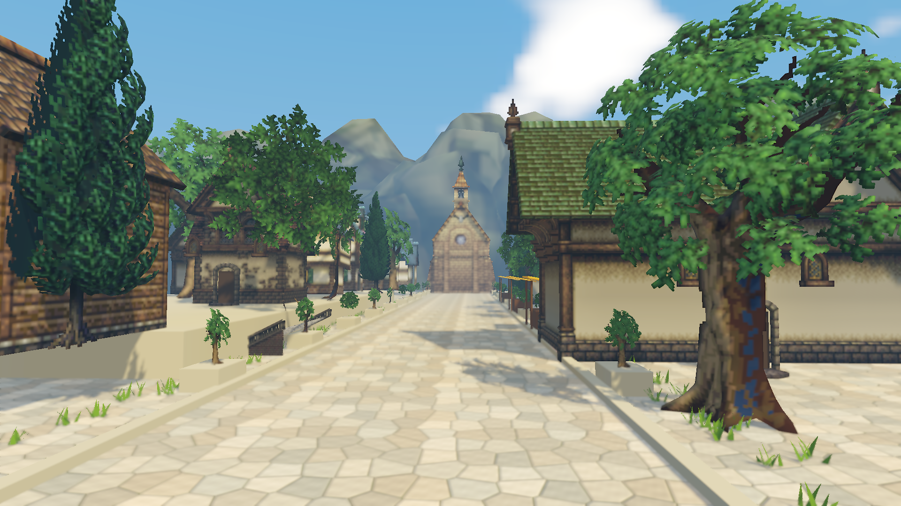

# 城镇渲染性能与 RenderDoc 证据

2026-10-07。Unity 6000.3.10f1，Windows x64 Development Player，独立 SRP，无包依赖，D3D11，NVIDIA GeForce RTX 5080。城镇 158 Renderer，含最新石板路/路边草，太阳/局部阴影及全部场景后处理开启。

**这些数据是暖机后的 GPU 离线回放事件耗时，不能换算为实时帧率。** 捕获范围是一次显式相机 RenderRequest，含绘制、dispatch、拷贝和清理，不含 CPU 调度和显示提交。每种分辨率运行280帧，再捕获一次；RenderDoc读7轮 `EventGPUDuration`，丢掉第一轮后取6轮中位数。原始样本、分段计时、actions与资源格式均在JSON中。

| 分辨率 | GPU事件总和中位数 | 报告 |
| --- | ---: | --- |
| 1280×720 | 4.214 ms | [720p JSON](Evidence/srp-town/GPU-1280x720.json) |
| 1920×1080 | 4.935 ms | [1080p JSON](Evidence/srp-town/GPU-1920x1080.json) |
| 2560×1440 | 5.451 ms | [1440p JSON](Evidence/srp-town/GPU-2560x1440.json) |

## 1080p 分段

| 阶段 | 中位 ms |
| --- | ---: |
| 三层太阳深度 | 2.028 |
| 局部阴影面 | .120 |
| 四 MRT GBuffer | .972 |
| 屏幕 PCSS | .119 |
| 分类方向光 | .022 |
| tile 列表与局部光 CS | .044 |
| 双 LUT | .023 |
| HDR TAA | .068 |
| 运动模糊 | .025 |
| 11点曝光历史 | .008 |
| 五尺度 Bloom | .067 |
| 电影曲线与颜色深度线条 | .037 |
| 后段时域、历史与最终输出 | .089 |
| 其他物体/天空/IBL、未标记拷贝和清理 | 1.274 |

分段中位数的和不必等于事件总和的中位数。Unity原生Renderer绘制有些落在CommandBuffer标记之外，工具根据深度数组层数和MRT格式归类太阳、局部阴影及GBuffer；其他未标记项保留在最后一行，不把它全部叫作IBL或拷贝时间。当前每帧915个draw、2个dispatch；实际优化优先关注阴影/物体绘制批次，之后再看全屏效果。

## 有效性与资源

1080p离线回放完成，1099 actions、915 draws、2 dispatches、39目标分组。最后一个draw是深度历史写入，**不能用最后一个draw的输出当最终颜色**。最终颜色为event7459、ResourceId::8984。其底层RT垂直方向与Unity PNG读回相反；对坐标进行垂直归一化后，2520个RGB通道抽样与Player PNG的最大/平均8位误差均为0，见 [比对记录](Evidence/srp-town/replay-color-comparison.json)。这检查的是同一次捕获读回与回放，不是两张不同时间的动画帧。

[原始RT回放图](Evidence/srp-town/Native-Replay-Raw.png) 保留底层方向；[回放状态](Evidence/srp-town/native-analysis_status.json)、[资源清单](Evidence/srp-town/native-inventory.json)、[回放消息](Evidence/srp-town/native-replay_messages.json)已归档。检查到2048²×3 R16 typeless太阳深度、512²×16局部D16栅格深度和R16F径向数组，以及四MRT和R11G11B10 HDR。D3D11底层资源均可为typeless，event3144的 [实际视图](Evidence/srp-town/native-shadow-event.json) 确认为R16_FLOAT颜色/D16_UNORM深度。

资源描述的纹理byteSize总和分别约174.1/320.8/526.2 MB。它包含引擎池、此前分辨率阶段的资源与采集目标；不是该帧同时存活的临时RT总量或显存峰值，不作为显存预算。缓冲区、网格和驱动分配也不在此总和内。

Player中的FrameTimingManager虽启用，但GPU样本为0，`gpuTimingAvailable=false`；[原始报告](Evidence/srp-town/frame-timing-manager.json)保留失败测量。CPU数字受批处理、手动RenderRequest和注入影响，未用其推导正常Game视图FPS。正式预算还需要非批处理Player、实时CPU/GPU帧和目标设备测量。

## 捕获清单

文件位于项目 `Captures/SRP-Town-Paraboloid`，RDC不应提交Git。完整大小、SHA-256、构建说明及源代码哈希见 [清单](Evidence/srp-town/capture-manifest.json)。

| 文件 | SHA-256 |
| --- | --- |
| Native-1280x720_capture.rdc | 0066648FC1FDD3FB8A72BDB332F27E2F5079F2F8AB526735E98FBCAAC00951F4 |
| Native-1920x1080_capture.rdc | 1A7511316FDBDF0CB6BAEBA1BAD3716E21CF4A070797A8607D26D1C9CE08961E |
| Native-2560x1440_capture.rdc | CEEDD289FFB68B4A0F7E233082D892C3C0CEEAA3F872B11992BA6FB56BAB0E17 |

早期实验位于 `Temp/RelinkTownCapturedEvidence`、`Captures/SRP-Town-Final`、`Captures/SRP-Town-BeforeBindingFix`、`Captures/SRP-Town`、`Captures/SRP-Town-Flagstone`；它们不是本报告的最终样本。最终版本改用新光源数组参数名，避免主编辑器把旧8元素全局数组容量缓存用于新32元素数组；无需重启编辑器。

## 复现

先按 [城镇文档](Relink-Town-Implementation.md) 运行验证和 `BuildBenchmarkPlayer`，再运行 `Tools/Rendering/capture_relink_town.ps1`。捕获脚本只启动本任务的验证播放器；不重启Relink或主Unity编辑器，不改变NVAPI配置。

单独回放计时，设置 `RELINK_TOWN_RDC` 和 `RELINK_TOWN_PROFILE_OUTPUT` 后，用RenderDoc 1.46的 `qrenderdoc.exe --python Tools/Rendering/profile_relink_town.py`。离线导出当前1080p最终颜色时，为 `inspect_relink_capture.py` 设置 `RELINK_FINAL_EVENT=7459`；新捕获应从actions表选择自己的事件编号。`publish_relink_town_evidence.py` 接受捕获/回放目录，检查源代码与构建一致、最终目标格式及Player/回放颜色后同步证据；需要Python与Pillow。

工具的纹理保存使用 [RenderDoc 官方示例](https://github.com/baldurk/renderdoc/blob/v1.46/docs/python_api/examples/renderdoc/save_texture.py) 的TextureSave接口；播放器调用仅针对已经注入的DLL，API布局来自 [官方1.46头文件](https://github.com/baldurk/renderdoc/blob/v1.46/renderdoc/api/app/renderdoc_app.h)。
